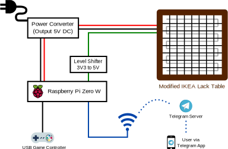
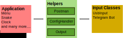

This repository contains software to drive games and apps on a 12x12 Matrix of WS2812B-LEDs. It handles different inputs such as USB hardware or Telegram bots and displays the output on a real LED matrix or a simulation.

1. [Features](#features)
2. [Project description](#project-description)
   * [Hardware architecture](#hardware-architecture)
   * [Software architecture](#software-architecture)
3. [Setup](#setup)
4. [Developer's Guide](#developers-guide)

## Features
* Control the table either via a **TelegramBot** or a **USB Gamepad** 
* **Ready-to-use simulator** makes development possible even when your table isn't built yet 
* **Spotify Connect integration** to display album art of currently played song on the table
* Display an awesome-looking **clock**.
* Color your  life with **ColorFade**. A simple screen saver.
* Play **Tetris**. Perfectly fit every block.
* Play **Snake**. Eat as much fruit as you can without eating yourself.

# Project description
## Hardware architecture
A [Raspberry Pi Zero W](https://www.raspberrypi.org/products/raspberry-pi-zero-w/) is used to control the table and to manage user interactions. The small single-board computer with a footprint of only 65mm x 35mm lets you hide the control unit in a small box unobtrusively attached to the table. Despite of its size it features a fully functional Linux system perfectly fitted for Python scripts while providing necessary interfaces like wireless LAN and USB.

## Software architecture
There are different kinds of classes making up the software as a whole. Each program part has its own function and each part can be (de-)activated separately (excluding `core`). `main.py` starts up to three threads and creates the instances of the core classes.

### Application
The main thread executing the games has its entry point in `Menu.py`. Besides printing the game's icons, the Menu class also starts all other games and then waits for their return. The application thread is mainly manipulating the output matrix.

### Core
The `core` modules are simply class instances passed to the threads. Note that there are no threads wrapping the core modules.

The **Postman** handles the communcation between the threads.

The **ConfigHandler** provides read and write access for all program parts to the central config file.

The **Output** is a intermediate layer for writing Pixels to the table. There are two different output classes available in the submodule `output`. Either the hardware table is controlled or the output can be redirected to a simulator.

### Input Classes
Currently there are two ways of receiving user input. Either a game controller can be attached to the Pi via USB or commands can be send to the table via Telegram. Just call the TelegramBot running on your table (every table needs its own Bot id) and he/she/it will explain everything to you.

Both input classes publish input events via the Postman.

# Setup

## Dependencies
* Python 3.6+
* Pillow:
`conda install -c anaconda pillow` or
`pip install Pillow`
* NeoPixel:
`pip install adafruit-circuitpython-neopixel`
* OpenCV:
`conda install -c conda-forge opencv` or
`pip install opencv`
* Spotipy:
`pip install spotipy`
* Telegram Python Bot:
`pip install python-telegram-bot` 

If you use conda, you can create an environment with all the necessary packages using the `environment.yml` file:  
`conda env create -f environment.yml`

## Setting up the Telegram Bot
Create a new Telegram bot using the Telegram's [BotFather](https://core.telegram.org/bots#6-botfather). It provides you with an individual token that allows you to access messages that are sent to it. In order to control the LED matrix using this bot, insert the token into the config file. In Telegram, address the bot by the handle that you chose at bot creation to send it commands.

## Setting up the Spotify Connection
In order to use the spotify functionality, create a spotify web app using the [developer dashboard](https://developer.spotify.com/dashboard/login). Insert the provided client id and the client secret into the config file.  In the settings of your newly created app, add a redirect URI such as `https://www.google.com` and paste it into the config file.  
At first use of the Spotify app on the table, users click a link and login to their Spotify account. After pressing "Authenticate", they get redirected to the specified URI and an authentication code appended to it. Users are asked to paste this URI with the included code into the bot, allowing the table to interact with Spotify on the user's behalf.

## Setting up the USB Gamepad

# Developer's Guide
In general, the python PIP guidelines are followed.

## Naming convention
Use under_score_names, not CamelCase.

## Pixel addressing
The origin of the LED Matrix is located in the upper left corner starting with position (0,0). It is most intuitive to think of a mathematical matrix and therefore use row and col indices. Clearly speaking, **don't use x-y coordinates** as this could be confusing. Contrasting to our addressing convetion, coordinate systems usually set their origin in the bottom left corner and the first index is along the horizontal axis.
